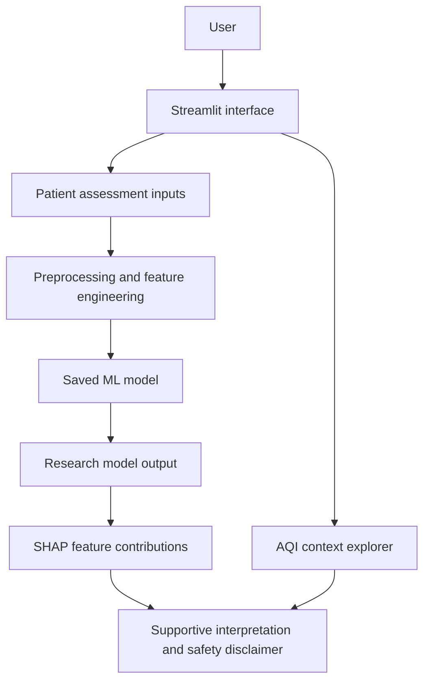

# Asthma Risk Analysis

A Streamlit research prototype that explores structured asthma-related factors, displays a machine-learning probability, visualises local AQI data, and explains model behaviour for an individual assessment.

> **Medical disclaimer:** This is an education and research project, not a medical device. It does not diagnose asthma and must not be used for screening, treatment, triage, emergency decisions, or as a substitute for a qualified clinician.

## Project overview

Asthma is influenced by respiratory symptoms, lung function, medical history, lifestyle, and environmental exposure. This project combines selected structured inputs in one interface so they can be explored alongside a trained classification model and a separate local AQI data explorer.

The application predicts the saved model's estimated probability for the dataset's binary `Diagnosis` label. It is an analytical model output, not a clinical diagnosis.

## Problem statement

Create a reproducible research workflow for analysing asthma-related structured data, deriving selected risk-related features, comparing classification models, and presenting model outputs with transparent limitations.

## Objectives

- Estimate the saved model's probability for the `Diagnosis` label.
- Analyse demographic, lifestyle, respiratory, history, allergy, and exposure inputs.
- Derive lung-function and symptom summary features.
- Explore the bundled AQI dataset by state and area.
- Show patient-level feature contributions using SHAP when available.

## Implemented features

- Streamlit patient assessment form with reset control.
- Research evaluation panel with validation status, baseline comparison, ROC-AUC, PR-AUC, F1, Brier score, and downloadable JSON results.
- Model probability and display tiers: Low `< 0.35`, Moderate `< 0.55`, High `< 0.75`, and Critical `>= 0.75`.
- Input checks that prevent an assessment when FEV1 exceeds FVC.
- FEV1/FVC, symptom, exposure, BMI, history, and lifestyle derived features.
- Per-assessment CSV download; the app itself does not store submitted inputs.
- Historical AQI explorer with latest, average, peak, and trend display.
- Per-prediction SHAP contribution chart, with a fallback chart if full SHAP generation is unavailable.
- Reproducible preprocessing, model training, hold-out evaluation, and saved evaluation plots.

## Dataset

| Dataset | Records | Fields | Use |
| --- | ---: | ---: | --- |
| `dataset/asthma.csv` | 2,392 | 29 | Model training and evaluation |
| `dataset/aqi.csv` | 235,785 | 9 | Environmental context shown in the app only |

`asthma.csv` has binary target `Diagnosis`: 2,268 class-0 records and 124 class-1 records. It contains no missing values in the bundled copy. The preprocessing script drops `PatientID` and `DoctorInCharge`, calls `dropna()` as a safeguard, normalises gender to 0/1, and creates the derived features below.

The training script applies SMOTE to the scaled training data for each candidate model. AQI is not an input to the prediction model.

## Parameters used

| Group | Inputs |
| --- | --- |
| Demographic | Age, Gender, Ethnicity, EducationLevel, BMI |
| Lifestyle | Smoking, PhysicalActivity, DietQuality, SleepQuality |
| Environmental exposure | PollutionExposure, PollenExposure, DustExposure, PetAllergy |
| Medical and allergy history | FamilyHistoryAsthma, HistoryOfAllergies, Eczema, HayFever, GastroesophagealReflux |
| Respiratory and symptoms | LungFunctionFEV1, LungFunctionFVC, Wheezing, ShortnessOfBreath, ChestTightness, Coughing, NighttimeSymptoms, ExerciseInduced |

## Feature engineering

- `FEV1_FVC_ratio` - FEV1 divided by FVC (zero FVC becomes 0).
- `RespiratorySymptomScore` - sum of the six symptom indicators.
- `AllergyExposureScore` - sum of pollution, pollen, dust exposure, and pet allergy values.
- `HighRiskHistory` - 1 when family asthma history, allergy history, or eczema is present.
- `BMI_category` - underweight, normal, overweight, or obese encoded as 0-3.
- `PoorLifestyleRisk` - 1 when activity is below 3, diet quality below 4, or sleep quality below 4.

## Machine-learning methodology

```text
Load asthma.csv
  -> clean and derive features
  -> stratified train/validation/test split (random_state=42)
  -> StandardScaler fitted on training data
  -> SMOTE on training data only
  -> compare Logistic Regression, Random Forest, and XGBoost
  -> select using validation average precision
  -> select a decision threshold on validation data
  -> refit the selected model on train plus validation data
  -> evaluate once on the untouched test split
```

`models/train_model.py` compares Logistic Regression, Random Forest, and XGBoost. `models/comprehensive_evaluation.py` runs the fixed hold-out analysis, majority baseline, threshold analysis, calibration, repeated stratified cross-validation, feature-group ablation, error analysis, subgroup analysis, and SHAP analysis.

## Current model evaluation

The current workflow keeps a final 20% test split separate from validation. The saved evaluation is a research result only and fails the validation quality gate because the model is close to random.

| Metric | Value |
| --- | ---: |
| Majority baseline accuracy | 94.78% |
| Model accuracy | 88.31% |
| Positive-class precision | 10.26% |
| Positive-class recall | 16.00% |
| Positive-class F1 | 12.50% |
| ROC-AUC | 50.20% |
| PR-AUC | 7.18% |
| Brier score | 0.0589 |
| Decision threshold | 0.22 |
| Confusion matrix | TN=419, FP=35, FN=21, TP=4 |

**Interpretation:** the model does not demonstrate useful discrimination. The positive-class prevalence is 5.18%, so the PR-AUC of 7.18% is only modestly above baseline, while ROC-AUC is approximately random. The model is therefore not suitable for asthma screening or clinical use. The application displays **NOT VALIDATED** when the quality gate fails.

### Current evaluation visual


## Explainable AI and AQI

For an entered profile, the app tries `shap.TreeExplainer` and then `shap.LinearExplainer` to display feature contributions. These values explain the saved model's behaviour for that input; they do not prove that a feature causes asthma.

The AQI explorer reads the bundled date, state, area, AQI value, and air-quality fields. It provides historical environmental context only and is not passed to the model.

## Application workflow



## Project structure

```text
major_project/
|-- app.py
|-- preprocessing.py
|-- requirements.txt
|-- dataset/
|   |-- asthma.csv
|   `-- aqi.csv
|-- models/
|   |-- train_model.py
|   |-- evaluate_model.py
|   |-- comprehensive_evaluation.py
|   |-- best_asthma_model.pkl
|   |-- preprocessor.pkl
|   |-- model_metadata.json
|   |-- evaluation_report.txt
|   |-- evaluation_results.json
|   `-- *.png                 # evaluation and feature-importance plots
|-- scripts/
|   `-- run_streamlit.ps1
`-- docs/
    `-- APP_PREVIEW.md
```

## Technologies

Python, Streamlit, pandas, NumPy, scikit-learn, imbalanced-learn, XGBoost, SHAP, Plotly, Matplotlib, Seaborn, and joblib. See `requirements.txt` for the full declared dependency list.

## Installation and local use

Prerequisites: Python 3.10+ and pip.

```powershell
git clone <repository-url>
cd major_project
python -m venv .venv
.\.venv\Scripts\Activate.ps1
pip install -r requirements.txt
streamlit run app.py
```

Then open the local address printed by Streamlit, normally `http://localhost:8501`.

Windows alternative:

```powershell
.\scripts\run_streamlit.ps1
```

## Public Streamlit link

No public Streamlit deployment link is configured in this repository. `localhost` and `http://<your-machine-ip>:8501` work only while the developer's machine is running the app; the latter is limited to the permitted local network.

To create a public link, push the repository to GitHub and deploy `app.py` through [Streamlit Community Cloud](https://share.streamlit.io/). It will provide an address in the form `https://<subdomain>.streamlit.app`. Do not publish this as a patient-facing service unless the model is first retrained, externally validated, clinically reviewed, and governed appropriately.

## Commit and push to GitHub

Review the changes before committing. Do not commit secrets, patient-identifying data, or local virtual-environment files.

```powershell
git status
git diff -- README.md app.py preprocessing.py models/train_model.py models/evaluate_model.py
git add README.md app.py preprocessing.py requirements.txt models docs scripts
git commit -m "Add trustworthy asthma model evaluation"
git branch --show-current
git push origin <your-branch-name>
```

If the GitHub repository has not been connected yet:

```powershell
git remote -v
git remote add origin https://github.com/<your-username>/<your-repository>.git
git branch -M main
git push -u origin main
```

Do not use `git add .` blindly. Check `git status` first, especially because model binaries and generated plots can be large. The repository should remain marked **NOT VALIDATED** until the target labels are audited and an independent external dataset confirms performance.

## App screenshots and video

The repository currently includes the evaluation figure above, but no genuine Streamlit dashboard screenshot or demo video. Add real, non-identifying assets using these paths, then reference them here:

```text
docs/screenshots/app-dashboard.png
docs/screenshots/risk-output.png
docs/demo/app-demo.mp4
```

Use the following Markdown after adding those files:

```md


[Watch the application demo](docs/demo/app-demo.mp4)
```

## Required changes to improve recall

1. **Audit labels and splits.** Verify the target definition, class mapping, duplicate handling, and whether the train/test split reflects the intended population.
2. **Choose a threshold from validation data.** Keep the probability output and select a threshold against a stated recall/precision trade-off; do not use the current display-tier cut-offs as a classifier threshold.
3. **Train for the intended objective.** Compare class weighting, SMOTE variants, and models using recall, precision-recall AUC, F1/F-beta, and calibration - not accuracy alone.
4. **Use a separate validation set and external test set.** Avoid selecting a model or threshold on the final test split.
5. **Report uncertainty and subgroup results.** Add confidence intervals, calibration plots, and results across relevant demographic groups.
6. **Obtain clinical and governance review.** Validate with representative data before any workflow that affects care.

## Current limitations

- The current model fails its validation quality gate; forcing 100% hold-out recall produces 5.25% precision and flags 476 of 479 records.
- The app uses a single structured assessment; it has no longitudinal history or real-time environmental exposure input.
- AQI data is contextual and may not represent an individual's actual exposure.
- The included data and evaluation do not establish clinical validity, calibration, fairness, or generalisability.
- The coded ethnicity and education fields lack user-facing category definitions in the application.
- There is no deployed public app URL.

## Future work (not implemented)

- Threshold selection and probability calibration on a validation dataset.
- Temporal/longitudinal exacerbation prediction.
- External validation, fairness analysis, and model monitoring.
- Clinician-reviewed data dictionary and user-facing category labels.
- Privacy, security, and governance controls required for real patient data.

## Research scope

This repository is relevant to Healthcare AI, Medical Informatics, Clinical Decision Support, Explainable AI, asthma and respiratory risk analysis, and environmental health. Its contribution is a transparent research prototype that combines a reproducible tabular ML workflow with an interactive visual interface and explicit performance limitations.

## Author

Author information has not been provided for this repository.
