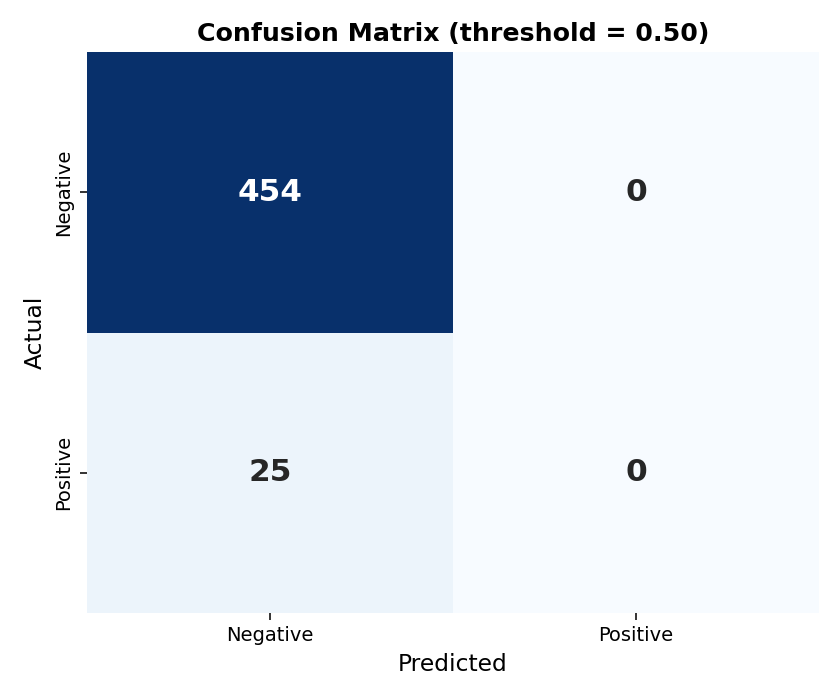
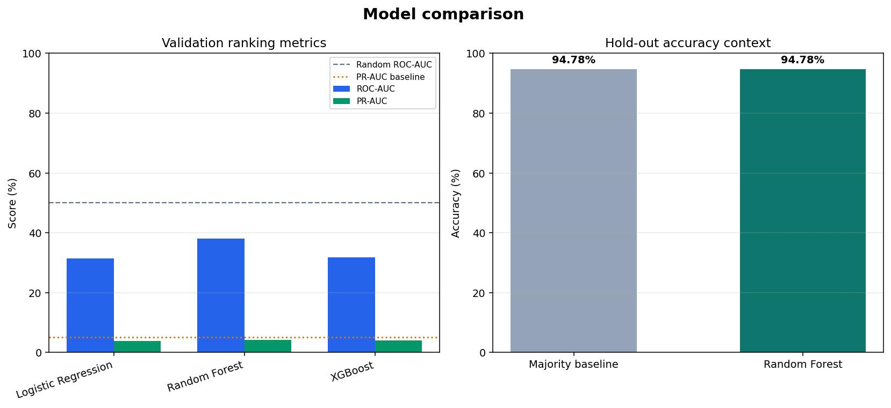
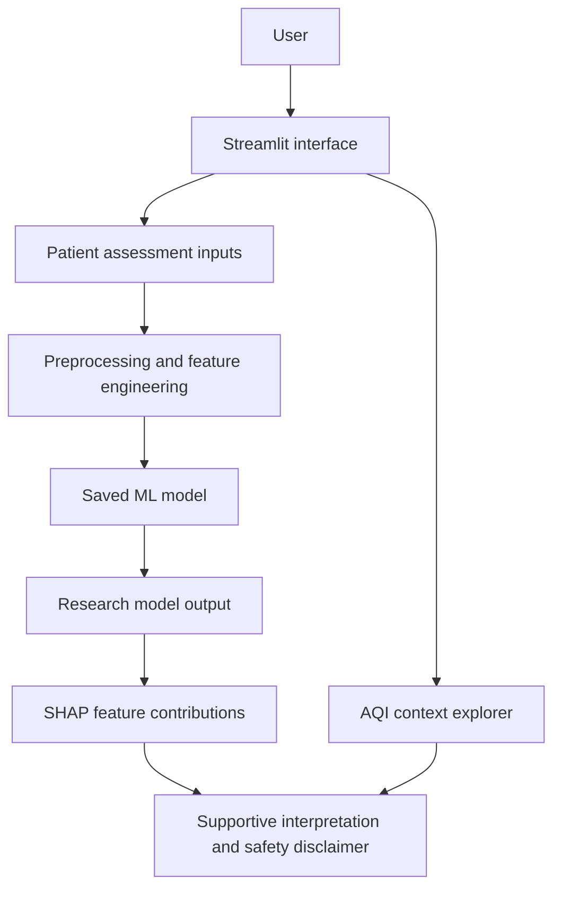

# Asthma Risk Analysis

A Streamlit research prototype that explores structured asthma-related factors, displays a machine-learning probability, visualises local AQI data, and explains model behaviour for an individual assessment.

> **Medical disclaimer:** This is an education and research project, not a medical device. It does not diagnose asthma and must not be used for screening, treatment, triage, emergency decisions, or as a substitute for a qualified clinician.

## Project overview

Asthma is influenced by respiratory symptoms, lung function, medical history, lifestyle, and environmental exposure. This project combines selected structured inputs in one interface so they can be explored alongside a trained classification model and a separate local AQI data explorer.

The application predicts the saved model's estimated probability for the dataset's binary `Diagnosis` label. It is an analytical model output, not a clinical diagnosis.

## Problem statement

Create a reproducible research workflow for analysing asthma-related structured data, deriving selected risk-related features, comparing classification models, and presenting model outputs with transparent limitations.

## Objectives

- Estimate the saved model's probability for the `Diagnosis` label.
- Analyse demographic, lifestyle, respiratory, history, allergy, and exposure inputs.
- Derive lung-function and symptom summary features.
- Explore the bundled AQI dataset by state and area.
- Show patient-level feature contributions using SHAP when available.

## Implemented features

- Streamlit patient assessment form with reset control.
- Research evaluation panel with validation status, baseline comparison, ROC-AUC, PR-AUC, F1, Brier score, and downloadable JSON results.
- Model probability and display tiers: Low `< 0.35`, Moderate `< 0.55`, High `< 0.75`, and Critical `>= 0.75`.
- Input checks that prevent an assessment when FEV1 exceeds FVC.
- FEV1/FVC, symptom, exposure, BMI, history, and lifestyle derived features.
- Per-assessment CSV download; the app itself does not store submitted inputs.
- Historical AQI explorer with latest, average, peak, and trend display.
- Per-prediction SHAP contribution chart, with a fallback chart if full SHAP generation is unavailable.
- Reproducible preprocessing, model training, hold-out evaluation, and saved evaluation plots.

## Dataset

| Dataset | Records | Fields | Use |
| --- | ---: | ---: | --- |
| `dataset/asthma.csv` | 2,392 | 29 | Model training and evaluation |
| `dataset/aqi.csv` | 235,785 | 9 | Environmental context shown in the app only |

`asthma.csv` has binary target `Diagnosis`: 2,268 class-0 records and 124 class-1 records. It contains no missing values in the bundled copy. The preprocessing script drops `PatientID` and `DoctorInCharge`, calls `dropna()` as a safeguard, normalises gender to 0/1, and creates the derived features below.

The training script applies SMOTE to the scaled training data for each candidate model. AQI is not an input to the prediction model.

## Parameters used

| Group | Inputs |
| --- | --- |
| Demographic | Age, Gender, EducationLevel, BMI |
| Lifestyle | Smoking, PhysicalActivity, DietQuality, SleepQuality |
| Environmental exposure | PollutionExposure, PollenExposure, DustExposure, PetAllergy |
| Medical and allergy history | FamilyHistoryAsthma, HistoryOfAllergies, Eczema, HayFever, GastroesophagealReflux |
| Respiratory and symptoms | LungFunctionFEV1, LungFunctionFVC, Wheezing, ShortnessOfBreath, ChestTightness, Coughing, NighttimeSymptoms, ExerciseInduced |

## Feature engineering

- `FEV1_FVC_ratio` - FEV1 divided by FVC (zero FVC becomes 0).
- `RespiratorySymptomScore` - sum of the six symptom indicators.
- `AllergyExposureScore` - sum of pollution, pollen, dust exposure, and pet allergy values.
- `HighRiskHistory` - 1 when family asthma history, allergy history, or eczema is present.
- `BMI_category` - underweight, normal, overweight, or obese encoded as 0-3.
- `PoorLifestyleRisk` - 1 when activity is below 3, diet quality below 4, or sleep quality below 4.

## Machine-learning methodology

```text
Load asthma.csv
  -> clean and derive features
  -> stratified train/validation/test split (random_state=42)
  -> StandardScaler fitted on training data
  -> SMOTE on training data only
  -> compare Logistic Regression, Random Forest, and XGBoost
  -> select using validation average precision
  -> select a decision threshold on validation data
  -> refit the selected model on train plus validation data
  -> evaluate once on the untouched test split
```

`models/train_model.py` compares Logistic Regression, Random Forest, and XGBoost. `models/comprehensive_evaluation.py` runs the fixed hold-out analysis, majority baseline, threshold analysis, calibration, repeated stratified cross-validation, feature-group ablation, error analysis, subgroup analysis, and SHAP analysis.

## Current model evaluation

The current workflow keeps a final 20% test split separate from validation. The saved evaluation is a research result only and fails the validation quality gate because the model is close to random.

| Metric | Value |
| --- | ---: |
| Majority baseline accuracy | 94.78% |
| Model accuracy | 88.31% |
| Positive-class precision | 10.26% |
| Positive-class recall | 16.00% |
| Positive-class F1 | 12.50% |
| ROC-AUC | 50.20% |
| PR-AUC | 7.18% |
| Brier score | 0.0589 |
| Decision threshold | 0.22 |
| Confusion matrix | TN=419, FP=35, FN=21, TP=4 |

**Interpretation:** the model does not demonstrate useful discrimination. The positive-class prevalence is 5.18%, so the PR-AUC of 7.18% is only modestly above baseline, while ROC-AUC is approximately random. The model is therefore not suitable for asthma screening or clinical use. The application displays **NOT VALIDATED** when the quality gate fails.

### Current evaluation visual





## Explainable AI and AQI

For an entered profile, the app tries `shap.TreeExplainer` and then `shap.LinearExplainer` to display feature contributions. These values explain the saved model's behaviour for that input; they do not prove that a feature causes asthma.

The AQI explorer reads the bundled date, state, area, AQI value, and air-quality fields. It provides historical environmental context only and is not passed to the model.

## Application workflow



## Project structure

```text
major_project/
|-- app.py
|-- preprocessing.py
|-- requirements.txt
|-- dataset/
|   |-- asthma.csv
|   `-- aqi.csv
|-- models/
|   |-- train_model.py
|   |-- evaluate_model.py
|   |-- comprehensive_evaluation.py
|   |-- best_asthma_model.pkl
|   |-- preprocessor.pkl
|   |-- model_metadata.json
|   |-- evaluation_report.txt
|   |-- evaluation_results.json
|   `-- *.png                 # evaluation and feature-importance plots
|-- scripts/
|   `-- run_streamlit.ps1
`-- docs/
    `-- APP_PREVIEW.md
```

## Technologies

Python, Streamlit, pandas, NumPy, scikit-learn, imbalanced-learn, XGBoost, SHAP, Plotly, Matplotlib, Seaborn, and joblib. See `requirements.txt` for the full declared dependency list.

## Installation and local use

Prerequisites: Python 3.10+ and pip.

```powershell
git clone <repository-url>
cd major_project
python -m venv .venv
.\.venv\Scripts\Activate.ps1
pip install -r requirements.txt
streamlit run app.py
```

Then open the local address printed by Streamlit, normally `http://localhost:8501`.

Windows alternative:

```powershell
.\scripts\run_streamlit.ps1
```

## App preview and results

The current model evaluation is available in [`models/evaluation_report.txt`](models/evaluation_report.txt), with plots and detailed results in the `models/` directory.

Run the application locally:

```powershell
streamlit run app.py
```

This is a research prototype and is **not validated for diagnosis or clinical decision-making**.
